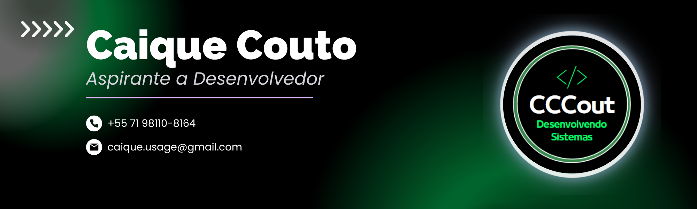

<h1 align="center">
  
</h1>

## Olá, este é o meu primeiro projeto.

>Irei tentar fazer um sistema "Web" de controle de processos, ultilizando phyton e sqlite3.

## Para rodar é necessário instalar alguns plugins adicionais, são eles:

- install pip
- pip3 install djangorestframework
- pip install django-crispy-forms
- pip install crispy-bootstrap4
- pip install django-braces
